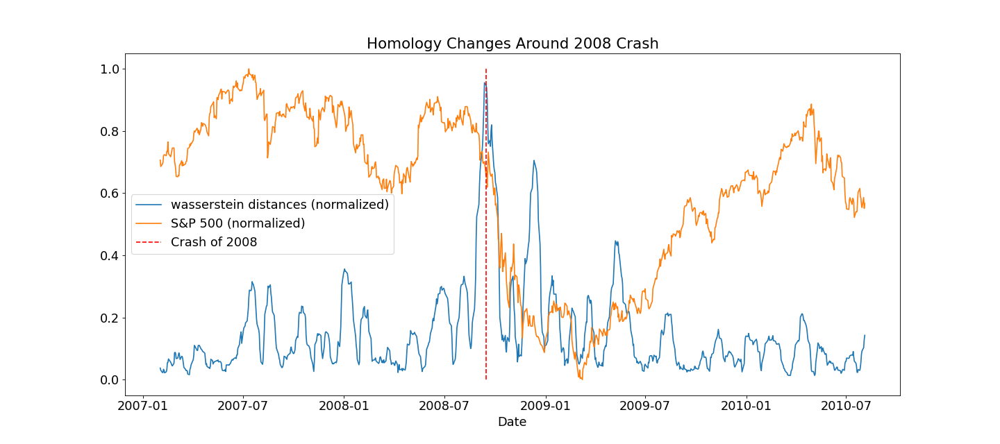
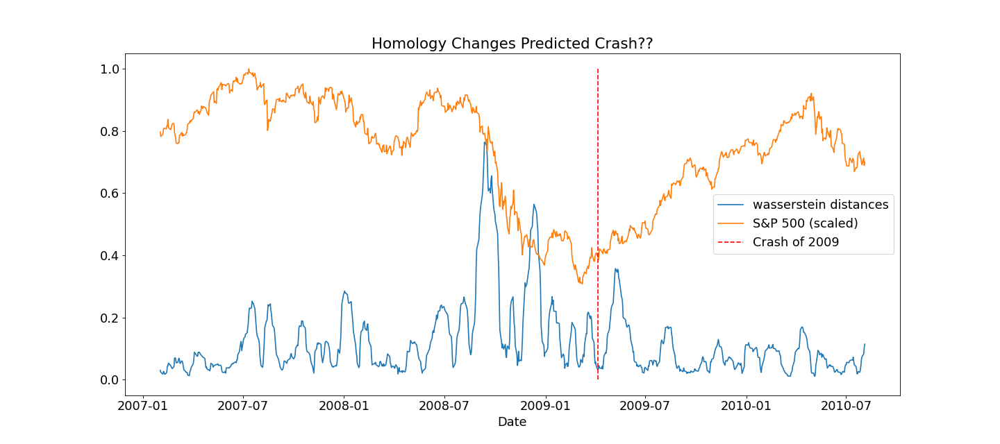

# LSTM Market Predictor: A Multi-Modal Deep Learning System for Automated Equity Trading

<div align="center">


*Figure 1. Live trading dashboard showing portfolio equity curve with TDA-based crisis detection banner.*

</div>

---

## Abstract

This project presents a fully automated equity trading system targeting the S&P 500 universe. The system fuses three distinct signal modalities — classical technical analysis, topological data analysis (TDA) of cross-asset return manifolds, and transformer-based news sentiment — into a unified feature vector consumed by a Long Short-Term Memory (LSTM) recurrent neural network. The model outputs a predicted log return for each ticker over the next trading day, which is thresholded to generate binary buy/hold/sell signals executed as paper trades through the Alpaca Markets API. The central novelty is the use of persistent homology — specifically the Wasserstein distance between consecutive $H_1$ persistence diagrams of the rolling cross-asset return point cloud — as a market-regime feature, with the hypothesis that this topological descriptor captures systemic correlation shifts invisible to any single-asset indicator.

---

## Table of Contents

- [1. Introduction & Motivation](#1-introduction--motivation)
- [2. Feature Engineering Pipeline](#2-feature-engineering-pipeline)
  - [2.1 Market Data & Window Design](#21-market-data--window-design)
  - [2.2 Technical Indicators](#22-technical-indicators)
  - [2.3 Topological Data Analysis](#23-topological-data-analysis)
  - [2.4 News Sentiment via FinBERT](#24-news-sentiment-via-finbert)
- [3. LSTM Model](#3-lstm-model)
  - [3.1 Recurrent Architecture & Gating](#31-recurrent-architecture--gating)
  - [3.2 Input Tensor & Feature Standardization](#32-input-tensor--feature-standardization)
  - [3.3 Target Variable](#33-target-variable)
- [4. Trading Strategy & Signal Logic](#4-trading-strategy--signal-logic)
  - [4.1 Crisis Detection via Wasserstein Thresholding](#41-crisis-detection-via-wasserstein-thresholding)
  - [4.2 Order Execution](#42-order-execution)
- [5. Setup](#5-setup)
- [6. Future Work: Advanced Mathematics](#6-future-work-advanced-mathematics)
  - [6.1 Multiparameter Persistence](#61-multiparameter-persistence)
  - [6.2 Persistent Laplacians & Spectral TDA](#62-persistent-laplacians--spectral-tda)
  - [6.3 Sheaf Theory on Market Networks](#63-sheaf-theory-on-market-networks)
  - [6.4 Zigzag Persistence for Non-Stationary Topology](#64-zigzag-persistence-for-non-stationary-topology)
  - [6.5 Path Signatures & Rough Path Theory](#65-path-signatures--rough-path-theory)
  - [6.6 Information Geometry of Return Distributions](#66-information-geometry-of-return-distributions)
  - [6.7 Topological Autoencoders & Representation Learning](#67-topological-autoencoders--representation-learning)
  - [6.8 Random Matrix Theory for Correlation Filtering](#68-random-matrix-theory-for-correlation-filtering)

---

## 1. Introduction & Motivation

Quantitative equity trading has historically relied on two broad families of signals: price-derived technical indicators and fundamental or macroeconomic data. The past decade has introduced a third pillar — alternative data, most notably text derived from news and social media. Simultaneously, the mathematics of algebraic topology has matured into a practical data analysis framework through the field of Topological Data Analysis (TDA), which can characterize the global "shape" of high-dimensional data in ways that point statistics cannot.

This system was designed around a central observation from mathematical finance: during market crises, the joint distribution of cross-asset returns undergoes a phase transition. In normal regimes, assets exhibit a diverse correlation structure — returns span a rich high-dimensional subspace. During stress events such as the 2008 financial crisis or the March 2020 COVID crash, pairwise correlations abruptly spike toward unity, collapsing the effective dimensionality of the return distribution. This transition is a fundamentally geometric and topological event that cannot be captured by examining any single asset's time series in isolation.

The three hypotheses motivating the design are:

**H1 — LSTM over Markov models.** Markets exhibit temporal dependencies spanning multiple timescales simultaneously — intraday momentum, weekly mean-reversion, monthly earnings cycles, and multi-year macro regimes. An LSTM with a 30-day lookback can, in principle, learn multi-scale temporal structure via its gating mechanism, unlike autoregressive models with fixed lag structure.

**H2 — Topology as a systemic risk proxy.** Persistent homology of the rolling cross-asset return point cloud captures the global correlation geometry of the market as a compact topological invariant. The Wasserstein distance between consecutive persistence diagrams measures the rate of change of this geometry — a signal of regime transition that is strictly non-local, encoding information about the entire universe of tracked assets simultaneously.

**H3 — FinBERT sentiment as a leading indicator.** The efficient market hypothesis posits that prices reflect all available information. However, the speed and completeness of information incorporation varies. News sentiment, scored by a model fine-tuned specifically on financial language, may encode forward-looking information that leads price action on the one-day horizon being predicted.

---

## 2. Feature Engineering Pipeline

### 2.1 Market Data & Window Design

For each prediction run, 90 calendar days of OHLCV (Open, High, Low, Close, Volume) data are downloaded for all tickers in the tracked universe via `yfinance`. The date window is:

$$t_{\text{start}} = t_{\text{today}} - 90 \text{ days}, \quad t_{\text{end}} = t_{\text{today}}$$

The window length is not arbitrary. It is the minimum required to satisfy all downstream constraints simultaneously, given that only $\frac{5}{7}$ of calendar days are trading days:

| Constraint | Trading Days Required |
|---|---|
| LSTM lookback window | 30 |
| First NaN from log return differentiation | 1 |
| 21-day rolling indicator warm-up | 21 |
| 30-day Wasserstein sliding window warm-up | 30 |
| Calendar-to-trading-day conversion buffer | ~13 |
| **Total (calendar days)** | **~90** |

---

### 2.2 Technical Indicators

Four derived scalar features augment the raw OHLCV data per ticker per day.

#### Relative Strength Index (RSI-14)

The RSI is a bounded momentum oscillator $\text{RSI}_t \in [0, 100]$ introduced by Wilder (1978). Define the average gain and loss over a window of $W = 14$ days using the Smoothed Moving Average (SMMA):

$$\overline{G}_t = \frac{1}{W}\sum_{i=0}^{W-1} \max(\Delta P_{t-i}, 0), \quad \overline{L}_t = \frac{1}{W}\sum_{i=0}^{W-1} \max(-\Delta P_{t-i}, 0)$$

$$\text{RS}_t = \frac{\overline{G}_t}{\overline{L}_t}, \quad \text{RSI}_t = 100 - \frac{100}{1 + \text{RS}_t}$$

When $\overline{L}_t = 0$ (no losing days in the window), we set $\text{RS}_t = \infty$ and $\text{RSI}_t = 100$ by convention. Values above 70 indicate overbought conditions; below 30, oversold.

#### Log Return

The continuously compounded one-day log return:

$$r_t = \ln\frac{P_t}{P_{t-1}} = \ln\!\left(1 + \frac{P_t - P_{t-1}}{P_{t-1}}\right)$$

Log returns are time-additive — the $k$-day return is $\sum_{i=1}^{k} r_{t-k+i}$ — and approximately Gaussian, making them preferable to simple returns for statistical models.

#### Realized Volatility

The 21-day realized volatility is the rolling standard deviation of log returns:

$$\hat{\sigma}_t = \sqrt{\frac{1}{W-1} \sum_{i=0}^{W-1} (r_{t-i} - \bar{r}_t)^2}, \quad W = 21, \quad \bar{r}_t = \frac{1}{W}\sum_{i=0}^{W-1} r_{t-i}$$

This is an estimator of the latent instantaneous volatility under a local constant-volatility model, and captures medium-term volatility regime with a window of approximately one calendar month.

#### Volume Z-Score

To make volume comparable across tickers with heterogeneous float sizes and trading activity:

$$Z_t^V = \frac{V_t - \hat{\mu}_t^V}{\hat{\sigma}_t^V}$$

where $\hat{\mu}_t^V$ and $\hat{\sigma}_t^V$ are the 21-day rolling mean and standard deviation of raw volume respectively. A large positive $Z_t^V$ indicates anomalously elevated participation, which empirically tends to precede or accompany significant price dislocations.

---

### 2.3 Topological Data Analysis

This is the mathematically central component of the system. The objective is to construct a compact, informative descriptor of the global correlation structure of the full S&P 500 universe on each trading day, using the machinery of algebraic topology.

#### Point Cloud Construction

At each time step $t$, a sliding window of width $W = 30$ days is extracted from the log-return matrix across all $N$ tracked tickers:

$$\mathbf{M}_{t} \in \mathbb{R}^{W \times N}$$

Each row $\mathbf{m}_t^{(d)} \in \mathbb{R}^N$ represents the joint log-return vector across all tickers on day $d$ within the window. The $W = 30$ rows of $\mathbf{M}_t$ constitute a *point cloud* $\mathcal{X}_t = \{\mathbf{m}_t^{(1)}, \ldots, \mathbf{m}_t^{(30)}\} \subset \mathbb{R}^N$.

The geometry of $\mathcal{X}_t$ encodes the joint distribution of returns over the window. In normal markets, when assets exhibit diverse and varying correlations, the point cloud is spread across many dimensions — it has complex shape. During a crisis, when all correlations spike toward unity, the points collapse onto a nearly one-dimensional manifold: the geometry simplifies catastrophically.

#### Simplicial Homology Background

Before defining the filtration, we briefly recall the homological algebra underlying persistence. Given a simplicial complex $K$, the $k$-th chain group $C_k(K; \mathbb{F})$ is the $\mathbb{F}$-vector space freely generated by the oriented $k$-simplices of $K$, where $\mathbb{F} = \mathbb{Z}/2\mathbb{Z}$ is the field of coefficients used here.

The boundary operator $\partial_k : C_k \to C_{k-1}$ maps each $k$-simplex to the formal sum of its $(k-1)$-faces:

$$\partial_k([v_0, \ldots, v_k]) = \sum_{i=0}^{k} (-1)^i [v_0, \ldots, \hat{v}_i, \ldots, v_k]$$

where $\hat{v}_i$ denotes omission. The fundamental identity $\partial_{k-1} \circ \partial_k = 0$ (boundaries have no boundary) defines the chain complex:

$$\cdots \xrightarrow{\partial_{k+1}} C_k \xrightarrow{\partial_k} C_{k-1} \xrightarrow{\partial_{k-1}} \cdots$$

The $k$-th homology group is the quotient:

$$H_k(K; \mathbb{F}) = \ker \partial_k \,/\, \text{im}\, \partial_{k+1}$$

Intuitively: $k$-cycles ($\ker \partial_k$) are $k$-dimensional "closed loops"; $k$-boundaries ($\text{im}\, \partial_{k+1}$) are those that bound a $(k+1)$-dimensional region. The homology $H_k$ counts topological features that are "holes" — cycles that are not boundaries. The Betti number $\beta_k = \dim H_k$ counts connected components ($\beta_0$), independent loops ($\beta_1$), enclosed voids ($\beta_2$), and so on.

#### Vietoris-Rips Filtration

Given the point cloud $\mathcal{X}_t$ with a metric $d$, the Vietoris-Rips complex at scale $\epsilon$ is:

$$\mathcal{R}_\epsilon(\mathcal{X}_t) = \left\{ \sigma \subseteq \mathcal{X}_t \;:\; d(x_i, x_j) \leq \epsilon \;\;\forall\, x_i, x_j \in \sigma \right\}$$

As $\epsilon$ increases from $0$ to $\infty$, this produces a nested family of complexes — a *filtration*:

$$\emptyset = \mathcal{R}_0 \subseteq \mathcal{R}_{\epsilon_1} \subseteq \mathcal{R}_{\epsilon_2} \subseteq \cdots \subseteq \mathcal{R}_\infty = \Delta^{|\mathcal{X}_t|-1}$$

Applying simplicial homology at each scale and tracking how homology classes are born and die across the filtration is the content of **persistent homology**. A class born at scale $b$ and dying at scale $d > b$ contributes a point $(b, d)$ to the $k$-th persistence diagram $\text{PD}_k(\mathcal{X}_t)$. The persistence $d - b$ measures the "lifetime" of that feature — long-lived features are topologically significant, while short-lived ones correspond to noise.

The `ripser` library computes this filtration up to `maxdim = 2` via the reduction algorithm on the coboundary matrix, yielding $\text{PD}_0$, $\text{PD}_1$, and $\text{PD}_2$.

#### Wasserstein Distance Between Persistence Diagrams

To convert the sequence of persistence diagrams $\{\text{PD}_1^{(t)}\}$ into a scalar time series, we compute the **$p$-Wasserstein distance** between consecutive $H_1$ diagrams. For two persistence diagrams $A$ and $B$, viewed as multisets of points in the extended half-plane $\bar{\mathbb{R}}^2_+ = \{(b,d) : b \leq d\}$:

$$d_{W_p}(A, B) = \left[\inf_{\gamma \in \Gamma(A,B)} \sum_{x \in A} \|x - \gamma(x)\|_\infty^p \right]^{1/p}$$

where $\Gamma(A,B)$ is the set of bijections between $A$ and $B$ augmented with the diagonal $\Delta = \{(b,b) : b \in \mathbb{R}\}$ (to handle diagrams of unequal cardinality — any unmatched point is matched to its nearest diagonal projection). The $L^\infty$ ground metric is used: $\|(b_1,d_1) - (b_2,d_2)\|_\infty = \max(|b_1-b_2|, |d_1-d_2|)$.

The temporal feature used in this system is $p = 2$:

$$W_t = d_{W_2}\!\left(\text{PD}_1^{(t)},\; \text{PD}_1^{(t-1)}\right)$$

This measures the minimum cost — in an Earth Mover's sense — to deform one $H_1$ diagram into the next. A large $W_t$ indicates a substantial rearrangement of the loop structure in the return point cloud between consecutive windows: a topological regime change.

The resulting scalar series $\{W_t\}$ is joined to the finance DataFrame as a market-wide (not per-ticker) column shared across all tickers' input vectors.

#### Why $H_1$ over $H_0$ and $H_2$?

$H_0$ tracks connected components. In the return point cloud, $H_0$ changes are dominated by isolated outlier trading days detaching from the main cluster — sensitive to noise rather than systemic structure. $H_2$ tracks enclosed voids; in 30-point clouds embedded in hundreds of dimensions, well-defined 2-dimensional voids are rare and computationally fragile. $H_1$ — tracking loops or cycles in the point cloud — is the most sensitive to changes in the correlation graph structure. In a diversified market, the point cloud has a rich arrangement of loops reflecting the complex web of partial correlations between sectors. When correlations collapse in a crisis, these loops vanish. The $H_1$ Wasserstein distance is therefore the most discriminating topological feature for regime detection.

#### Empirical Validation on Historical Data

The following plots show the normalized $H_1$ Wasserstein distance (blue) overlaid against the S&P 500 index (orange) over the 2007–2010 period, computed from this pipeline on historical data.

<div align="center">



*Figure 2. The Wasserstein distance spikes sharply at the Lehman Brothers collapse (red dashed line, September 2008), capturing the sudden collapse in cross-asset correlation structure. Note the elevated but chaotic Wasserstein activity throughout 2008 as the credit crisis developed, culminating in the spike at the acute phase.*

</div>

<div align="center">



*Figure 3. The same indicator over the full GFC episode through the March 2009 market trough. The Wasserstein distance begins spiking in mid-2008 — several months before the index reaches its nadir — suggesting the topological signal leads price action. The topology of the return manifold destabilizes before the index reaches its lowest point, potentially offering early warning of the market bottom.*

</div>

These plots empirically support the key hypothesis: the $H_1$ Wasserstein distance encodes systemic information about cross-asset correlation geometry that precedes or coincides with extreme market events.

---

### 2.4 News Sentiment via FinBERT

For each ticker, headlines are retrieved from the Google News RSS feed using a date-bounded search query. Headlines are scored using **ProsusAI/finbert**, a BERT-base encoder (12 transformer layers, 768 hidden dimensions, 110M parameters) fine-tuned on the Financial PhraseBank — a dataset of 4,840 financial news sentences annotated by finance professionals.

The model computes a three-class softmax over the label set $\mathcal{C} = \{\text{positive}, \text{neutral}, \text{negative}\}$:

$$P(c \mid \mathbf{h}_{\texttt{[CLS]}}) = \text{softmax}(\mathbf{W}_c \, \mathbf{h}_{\texttt{[CLS]}} + \mathbf{b}_c)$$

where $\mathbf{h}_{\texttt{[CLS]}} \in \mathbb{R}^{768}$ is the final hidden state of the `[CLS]` token, which aggregates sentence-level context via the bidirectional self-attention mechanism across all 12 layers.

The argmax label is extracted and mapped to a numeric score:

$$s_t^i = \begin{cases} +1 & \arg\max_c P(c \mid \text{headline}_{t}^{i}) = \text{positive} \\ 0 & \text{neutral} \\ -1 & \text{negative} \end{cases}$$

This ternary encoding is a deliberate simplification — the full probability distribution $P(\cdot \mid \text{headline})$ could instead be used as a richer three-dimensional feature vector, which is one avenue for future improvement.

---

## 3. LSTM Model

### 3.1 Recurrent Architecture & Gating

The model (`lstm.keras`) is a Long Short-Term Memory network. Unlike vanilla RNNs, which suffer from vanishing gradients over long sequences and therefore cannot learn dependencies beyond a few time steps, the LSTM maintains a separate cell state $\mathbf{c}_t$ that can in principle carry information across the full sequence length without multiplicative gradient attenuation.

An LSTM cell processes an input $\mathbf{x}_t \in \mathbb{R}^F$ at each time step via three learned gates and a candidate cell update:

$$\mathbf{f}_t = \sigma(\mathbf{W}_f [\mathbf{h}_{t-1};\, \mathbf{x}_t] + \mathbf{b}_f) \quad \text{(forget gate: what to erase from } \mathbf{c}_{t-1}\text{)}$$

$$\mathbf{i}_t = \sigma(\mathbf{W}_i [\mathbf{h}_{t-1};\, \mathbf{x}_t] + \mathbf{b}_i) \quad \text{(input gate: what new information to write)}$$

$$\mathbf{o}_t = \sigma(\mathbf{W}_o [\mathbf{h}_{t-1};\, \mathbf{x}_t] + \mathbf{b}_o) \quad \text{(output gate: what to expose from the cell)}$$

$$\tilde{\mathbf{c}}_t = \tanh(\mathbf{W}_c [\mathbf{h}_{t-1};\, \mathbf{x}_t] + \mathbf{b}_c) \quad \text{(candidate cell state)}$$

$$\mathbf{c}_t = \mathbf{f}_t \odot \mathbf{c}_{t-1} + \mathbf{i}_t \odot \tilde{\mathbf{c}}_t \quad \text{(cell state update)}$$

$$\mathbf{h}_t = \mathbf{o}_t \odot \tanh(\mathbf{c}_t) \quad \text{(hidden state / output)}$$

where $\sigma$ is the logistic sigmoid, $\odot$ denotes element-wise (Hadamard) product, and $[\mathbf{a}; \mathbf{b}]$ denotes vector concatenation. All weight matrices $\mathbf{W}_\star$ and bias vectors $\mathbf{b}_\star$ are learned during training via backpropagation through time (BPTT).

The forget gate $\mathbf{f}_t$ is particularly important for financial time series: it allows the network to learn when to "reset" its memory — for example, after a gap event or earnings announcement — versus when to accumulate momentum information across many steps.

### 3.2 Input Tensor & Feature Standardization

Each ticker's feature matrix over the 30-day prediction window is assembled as:

$$\mathbf{X}_i \in \mathbb{R}^{T \times F}, \quad T = 30, \; F = 10$$

All $N$ tickers are stacked into a single 3D batch tensor for efficient parallel inference:

$$\mathbf{X} \in \mathbb{R}^{N \times T \times F}$$

Before assembly, each feature is standardized using the training-set mean and standard deviation (stored in `scaler.pkl`):

$$\tilde{x}_{i,t,f} = \frac{x_{i,t,f} - \mu_f}{\sigma_f}$$

This is critical for LSTM stability — without normalization, features with different natural scales (e.g., Close prices in hundreds of dollars versus log returns in $[-0.1, 0.1]$) would require drastically different gradient magnitudes, destabilizing the gating mechanism.

The 10 input features per timestep are:

| # | Feature | Raw Domain | Information |
|---|---|---|---|
| 1 | `Close` | $\mathbb{R}_{>0}$ (USD) | Absolute price level |
| 2 | `High` | $\mathbb{R}_{>0}$ (USD) | Intraday upper range |
| 3 | `Low` | $\mathbb{R}_{>0}$ (USD) | Intraday lower range |
| 4 | `Open` | $\mathbb{R}_{>0}$ (USD) | Gap-open dynamics |
| 5 | `RSI_14` | $[0, 100]$ | Momentum / mean-reversion state |
| 6 | `Volatility_21` | $\mathbb{R}_{\geq 0}$ | Volatility regime |
| 7 | `Volume` | $\mathbb{Z}_{>0}$ (shares) | Liquidity / market participation |
| 8 | `Volume_Z` | $\mathbb{R}$ (std devs) | Anomalous volume signal |
| 9 | `Sentiment` | $\{-1, 0, +1\}$ | FinBERT news polarity |
| 10 | `Wasserstein` | $\mathbb{R}_{\geq 0}$ | Market topology / systemic risk |

Note that features 1–9 are *per-asset* (different values for each ticker), while feature 10 is *market-wide* (identical across all tickers on a given day). This asymmetry is intentional: the Wasserstein distance characterizes the joint state of the entire market, which provides the same regime context to every asset's prediction.

### 3.3 Target Variable

The model is trained on supervised regression to predict the one-day-ahead log return:

$$y_{i,t} = r_{i,t+1} = \ln \frac{P_{i,t+1}}{P_{i,t}}$$

At inference time, the model outputs a scalar $\hat{y}_i$ per ticker — the predicted continuously compounded return. This is a *point estimate* of the return distribution's mean; the model does not currently output uncertainty estimates, which is an important limitation discussed in §6.

---

## 4. Trading Strategy & Signal Logic

### 4.1 Crisis Detection via Wasserstein Thresholding

After inference, a secondary analysis detects potential market crises from the 90-day Wasserstein series $\{W_t\}_{t=1}^{T}$. The most recent value $W_T$ is compared against two simultaneous thresholds:

$$\text{crisis} = \mathbb{1}\!\left[W_T > \mu_W + 2\sigma_W\right] \;\lor\; \mathbb{1}\!\left[W_T > Q_{0.95}(\{W_t\})\right]$$

where $\mu_W = \frac{1}{T}\sum_t W_t$ and $\sigma_W^2 = \frac{1}{T-1}\sum_t (W_t - \mu_W)^2$ are the sample mean and variance of the full window, and $Q_{0.95}$ denotes the 95th empirical quantile.

The disjunction of two complementary criteria is deliberate. The $\mu + 2\sigma$ threshold assumes approximate Gaussianity of $\{W_t\}$ — under this assumption, it flags the top $\approx 2.5\%$ of values. However, the empirical distribution of Wasserstein distances is right-skewed (large crises produce extreme outliers that inflate $\sigma_W$, widening the threshold and reducing sensitivity). The percentile threshold is resistant to this effect, providing a more robust tail detector. Together they reduce both false negatives (missed crises) and false positives (false alarms from high-volatility-of-volatility regimes).

When a crisis is detected, `crisis_status = true` is returned and displayed as a warning banner in the dashboard. **Trading is not automatically suspended** — the flag is informational, allowing human judgment to interpret the signal in context.

### 4.2 Order Execution

Given the vector of predicted log returns $\{\hat{y}_i\}$ and current Alpaca portfolio positions $\mathcal{P}$, the signal rule is:

$$\text{action}(i) = \begin{cases} \text{BUY} & \hat{y}_i \geq \tau \;\land\; i \notin \mathcal{P} \\ \text{HOLD} & \hat{y}_i \geq \tau \;\land\; i \in \mathcal{P} \\ \text{SELL} & \hat{y}_i < \tau \;\land\; i \in \mathcal{P} \\ \text{SKIP} & \hat{y}_i < \tau \;\land\; i \notin \mathcal{P} \end{cases}$$

where $\tau = 0.004$ is the buy threshold (approximately $+0.4\%$ expected log return). For BUY orders, the share quantity is:

$$q_i = \left\lfloor \frac{B}{P_i^{\text{last}}} \right\rfloor, \quad B = \$1{,}000$$

All orders are market orders with `time_in_force = day`. Before executing, the Alpaca activity log is queried to enforce a once-per-day execution guarantee:

$$\text{execute} \iff \lnot\, \exists\, a \in \text{Activities} : \text{date}(a) = t_{\text{today}}^{\text{EST}}$$

---

## 5. Setup

**Backend (Python):**
```bash
cd src/model-backend
python -m venv .venv && source .venv/bin/activate
pip install -r requirements.txt
# Place lstm.keras, scaler.pkl, symbol_to_security.pkl in src/model-backend/
# Add ALPACA_API_KEY and ALPACA_SECRET_KEY to src/model-backend/.env
uvicorn server:app --host 127.0.0.1 --port 8000
```

**Frontend (.NET 9 Blazor):**
```bash
cd src/frontend && dotnet run
```

The backend URL is configured in `src/frontend/appsettings.json` under `Backend:BaseUrl`. Model and strategy parameters (buy threshold $\tau$, notional $B$, window sizes) are hardcoded constants in `src/model-backend/server.py`.

---

## 6. Future Work: Advanced Mathematics

The current implementation uses the $H_1$ Wasserstein distance as a single scalar summary of market topology. This is a deliberate first step — it demonstrates the viability of topological features in this setting — but it discards an enormous amount of the mathematical structure available. The following directions represent both natural extensions and fundamentally new frameworks.

### 6.1 Multiparameter Persistence

The current pipeline uses *one-parameter* persistence: homology is tracked as a function of a single filtration parameter $\epsilon$ (the Rips scale). A natural and more expressive generalization is **multiparameter persistent homology**, where homology is tracked over a multi-dimensional filtration parameter space.

For market data, the most natural two-parameter filtration combines the Rips scale $\epsilon$ with a density filtration $\nu$. Define the density of a point $x \in \mathcal{X}$ at scale $r$ as:

$$\rho_r(x) = \frac{|\{y \in \mathcal{X} : d(x,y) \leq r\}|}{|\mathcal{X}|}$$

The two-parameter Rips-density filtration $\mathcal{R}_{(\epsilon, \nu)}$ includes a simplex $\sigma$ only when its Rips condition is satisfied *and* all its vertices have density at least $\nu$. This filters out topological features arising from low-density outlier points — a significant noise reduction compared to one-parameter Rips applied to raw return data.

The algebraic output is no longer a collection of intervals (barcodes) but a **persistence module** over the poset $(\mathbb{R}^2, \leq)$:

$$\mathbb{M} : (\epsilon, \nu) \mapsto H_k(\mathcal{R}_{(\epsilon,\nu)})$$

The theory of multiparameter persistence is substantially harder than the one-parameter case: there is no complete discrete invariant analogous to the barcode, and the space of persistence modules does not admit a unique decomposition. Current practical approaches use **fibered barcodes** (one-parameter slices through the 2D parameter space) or the **rank invariant** $\xi(\mathbf{u}, \mathbf{v}) = \text{rank}(H_k(\mathcal{R}_\mathbf{u}) \to H_k(\mathcal{R}_\mathbf{v}))$, which is stable but not complete. Incorporating multiparameter features would allow the model to separately characterize topology at different density/scale combinations, potentially distinguishing core-market from peripheral-stock behavior within the same filtration.

### 6.2 Persistent Laplacians & Spectral TDA

The **combinatorial Laplacian** (Hodge Laplacian) of a simplicial complex $K$ at dimension $k$ is:

$$\mathbf{L}_k = \partial_{k+1} \partial_{k+1}^T + \partial_k^T \partial_k$$

where $\partial_k$ is the boundary matrix. The spectrum of $\mathbf{L}_k$ encodes both topological and geometric information: the kernel $\ker \mathbf{L}_k \cong H_k(K)$ recovers homology, while the non-zero eigenvalues characterize the "roughness" of the $k$-dimensional skeleton.

In the persistent setting, one can define **persistent Laplacians** $\mathbf{L}_k^{(\epsilon, \epsilon')}$ for pairs $\epsilon \leq \epsilon'$ in the filtration, using the boundary maps of the persistent chain complex. The non-harmonic eigenvalues of these persistent Laplacians capture geometric features of the filtration that are invisible to the barcode. Specifically, for market return point clouds, the spectral gap $\lambda_1(\mathbf{L}_1^{(\epsilon, \epsilon')})$ (smallest nonzero eigenvalue of the persistent 1-Laplacian) could serve as a feature encoding the "connectivity rigidity" of the $H_1$ topology — how strongly the observed loops resist deformation under perturbations of the return distribution.

The persistent Laplacian eigenvalues are stable under small perturbations of the point cloud (analogous to the stability theorem for persistent homology), and they provide a continuous spectral summary that could replace or supplement the discrete Wasserstein distance as the topological feature fed into the LSTM.

### 6.3 Sheaf Theory on Market Networks

A **cellular sheaf** on a graph $G = (V, E)$ assigns a vector space $\mathcal{F}(v)$ to each vertex and $\mathcal{F}(e)$ to each edge, along with linear restriction maps $\mathcal{F}(v \trianglelefteq e) : \mathcal{F}(v) \to \mathcal{F}(e)$ for each incident vertex-edge pair.

Applied to a market network where vertices are assets and edge weights encode return correlation, a sheaf model could assign to each vertex $v_i$ the local state space of asset $i$ (its feature vector over time), and encode the restriction maps as the learned correlation structure between neighboring assets in the graph. The **sheaf Laplacian**:

$$\mathbf{L}_{\mathcal{F}} = \mathbf{B}^T \mathbf{B}, \quad \mathbf{B}_{e, v} = \mathcal{F}(v \trianglelefteq e)$$

then provides a global consistency measure — the **sheaf cohomology** $H^0(\mathcal{F})$ captures sections of the sheaf (globally consistent assignments of asset states), and its dimension tracks the number of "consensus directions" in the market.

A large $\dim H^0(\mathcal{F})$ might indicate that asset states are globally consistent (trending market), while a small $\dim H^0(\mathcal{F})$ indicates high heterogeneity. The **coboundary** $\delta \mathbf{x} = \mathbf{B}\mathbf{x}$ measures the disagreement between neighboring assets' states, potentially providing a richer topological encoding of market consensus or divergence than any per-asset indicator.

Sheaf neural networks, which generalize graph neural networks by replacing scalar edge weights with linear maps, could be used to learn the sheaf restriction maps directly from data — end-to-end learning of the market's topological structure.

### 6.4 Zigzag Persistence for Non-Stationary Topology

Standard persistent homology tracks features as a filtration grows monotonically. However, the sequence of point clouds $\{\mathcal{X}_t\}$ over time is not a filtration — the cloud changes arbitrarily from window to window. **Zigzag persistence** (Carlsson & de Silva, 2010) generalizes persistent homology to sequences of spaces connected by maps in alternating directions:

$$\mathcal{X}_{t_1} \leftrightarrow \mathcal{X}_{t_1} \cup \mathcal{X}_{t_2} \leftrightarrow \mathcal{X}_{t_2} \leftrightarrow \mathcal{X}_{t_2} \cup \mathcal{X}_{t_3} \leftrightarrow \cdots$$

Each pair of consecutive point clouds is connected by inclusion maps into their union, yielding a zigzag diagram of vector spaces and linear maps. Applying the structure theorem for zigzag modules (analogous to the barcode decomposition) produces a zigzag barcode $\{[b_j, d_j]\}_j$ where each interval $[b_j, d_j]$ represents a topological feature that is born at time $t = b_j$ and dies at time $t = d_j$ in the sequence of point clouds.

Applied to the rolling cross-asset return windows, zigzag persistence would produce a direct encoding of the *temporal evolution* of topological features — which loops persist across many consecutive windows (stable market structure) versus which appear and disappear rapidly (transient correlation patterns). This is a strictly more informative representation than the pairwise Wasserstein distance currently used, which only captures the magnitude of change between consecutive windows without tracking the identity of individual features across time.

### 6.5 Path Signatures & Rough Path Theory

The **signature** of a path $\mathbf{X} : [0,T] \to \mathbb{R}^d$ is the collection of all iterated integrals:

$$S(\mathbf{X})_{s,t} = \left(1, \int_s^t dX^i, \int_{s < u_1 < u_2 < t} dX^{i_1} dX^{i_2}, \int_{s < u_1 < u_2 < u_3 < t} dX^{i_1} dX^{i_2} dX^{i_3}, \ldots \right)$$

The signature takes values in the tensor algebra $T((\mathbb{R}^d)) = \prod_{k=0}^\infty (\mathbb{R}^d)^{\otimes k}$. By the **universal nonlinearity theorem** (Chen, 1958; Hambly-Lyons, 2010), every continuous function on compact sets of paths can be approximated arbitrarily well by a linear functional on the signature — making it the natural feature map for sequential data in the same way that polynomials are the natural features for static data.

For a multivariate financial time series (the joint price path of all tracked assets), the **log-signature** (the logarithm in the free nilpotent Lie algebra) provides a finite-dimensional, graded summary of the path's shape up to a given degree. The degree-2 terms encode area swept (related to quadratic covariation), degree-3 terms encode the order of movements, and higher-degree terms capture increasingly complex path geometry.

Unlike the feature-engineering approach of computing discrete indicators (RSI, volatility, etc.), the signature approach is in principle *lossless* up to tree-like equivalence — it captures all information about the path except for its time-reparameterization. Replacing the 10-feature per-timestep vector with a truncated log-signature of the multivariate price path could substantially improve the LSTM's ability to encode complex cross-asset dynamics without manual feature design.

### 6.6 Information Geometry of Return Distributions

Rather than treating the return distribution as a point cloud in Euclidean space, one can model each window $t$ as a parametric distribution $p_t(\cdot; \boldsymbol{\theta}_t) \in \mathcal{M}$, where $\mathcal{M}$ is a statistical manifold — the space of probability distributions equipped with the **Fisher-Rao metric**:

$$g_{ij}(\boldsymbol{\theta}) = \mathbb{E}_{p(\cdot;\boldsymbol{\theta})}\!\left[\frac{\partial \log p}{\partial \theta^i} \frac{\partial \log p}{\partial \theta^j}\right]$$

This is the unique Riemannian metric on $\mathcal{M}$ (up to scaling) that is invariant under sufficient statistics — the natural geometric structure of the space of distributions.

For Gaussian return distributions $\mathcal{N}(\boldsymbol{\mu}_t, \boldsymbol{\Sigma}_t)$, the Fisher-Rao geodesic distance has a closed form involving the Mahalanobis distance between means and the log-ratio of covariance matrices. The **geodesic distance between consecutive return distributions** on this manifold would be a principled replacement for the Euclidean-based Wasserstein distance currently used, with the advantage of accounting for the full covariance structure rather than just the point cloud geometry.

Furthermore, the **$\alpha$-connections** of information geometry (Amari, 1985) define a family of affine connections on $\mathcal{M}$ parameterized by $\alpha \in [-1, 1]$. The $\alpha = 0$ connection is the Levi-Civita connection of the Fisher-Rao metric; $\alpha = \pm 1$ are the exponential and mixture connections of exponential family distributions. The curvature of $\mathcal{M}$ under these connections encodes the non-Gaussian nature of the return distribution — a measure of tail risk and departure from normality that is complementary to the topological features.

### 6.7 Topological Autoencoders & Representation Learning

The current approach feeds hand-engineered topological features (Wasserstein distance) into an LSTM. A more powerful direction is **end-to-end topological learning**: training a neural network whose loss function includes a topological regularization term that directly shapes the learned representation's topology.

The **topological autoencoder** (Moor et al., 2020) augments the standard reconstruction loss with a **topological signature loss**:

$$\mathcal{L} = \mathcal{L}_{\text{recon}} + \lambda \cdot \mathcal{L}_{\text{topo}}$$

where the topological loss penalizes differences between the persistence diagram of the input point cloud and the persistence diagram of its latent encoding:

$$\mathcal{L}_{\text{topo}} = d_{W_2}\!\left(\text{PD}(\mathcal{X}),\; \text{PD}(f_\theta(\mathcal{X}))\right)$$

This requires differentiating through the persistence diagram computation. Recent work (Gabrielsson et al., 2020; Brüel-Gabrielsson et al., 2020) shows that the Wasserstein loss $\mathcal{L}_{\text{topo}}$ is sub-differentiable almost everywhere, enabling gradient-based optimization.

Applied to the market prediction setting, a topological autoencoder pretrained on the cross-asset return point clouds would learn latent representations that preserve the topological structure of the market — the encoded representation would have similar homology to the input return manifold. The latent vectors could then be used as richer, topology-aware market embeddings fed into the LSTM, replacing both the Wasserstein scalar and the raw feature vector.

### 6.8 Random Matrix Theory for Correlation Filtering

The cross-asset return covariance matrix $\hat{\boldsymbol{\Sigma}}_t \in \mathbb{R}^{N \times N}$ estimated from a window of $T$ trading days with $N$ assets is subject to substantial estimation noise when $T/N$ is small. For $T = 30$ and $N = 500$ (full S&P 500), the ratio $c = N/T = 16.7 \gg 1$, placing us in the regime where nearly all sample eigenvalues are noise-dominated.

**Random Matrix Theory** (RMT) provides a precise characterization of this noise. Under the Marchenko-Pastur law, if the true covariance is the identity (pure noise), the empirical eigenvalue distribution of $\hat{\boldsymbol{\Sigma}}$ converges to:

$$\rho_c(\lambda) = \frac{\sqrt{(\lambda_+ - \lambda)(\lambda - \lambda_-)}}{2\pi c \lambda}, \quad \lambda \in [\lambda_-, \lambda_+]$$

$$\lambda_{\pm} = (1 \pm \sqrt{c})^2$$

Eigenvalues outside the Marchenko-Pastur bulk $[\lambda_-, \lambda_+]$ are statistically significant — they carry genuine factor structure. Projecting the covariance onto only the subspace spanned by the significant eigenvectors produces a **noise-cleaned covariance matrix** $\hat{\boldsymbol{\Sigma}}_t^{\text{clean}}$.

The point cloud for TDA could be constructed from the rows of $\hat{\boldsymbol{\Sigma}}_t^{\text{clean}}$ rather than the raw return matrix $\mathbf{M}_t$, substantially reducing noise in the persistence diagrams and sharpening the topological features. Moreover, the evolution of the significant eigenvalue spectrum itself — the number, magnitudes, and eigenvector directions of the above-bulk eigenvalues — is a rich signal of market factor structure that could supplement the topological features.

In the language of random matrix theory, the first (largest) eigenvalue corresponds to the market mode (all assets moving together), and its eigenvector loading evolves over time, capturing the degree of systemic co-movement. This is directly related to the topological $H_0$ signal (number of connected components) but with a cleaner statistical foundation — an RMT-filtered TDA pipeline would combine the best of both frameworks.

---

*For the full model training pipeline, see `model/model.ipynb`. For the inference and feature engineering implementation, see `src/model-backend/server.py`.*
